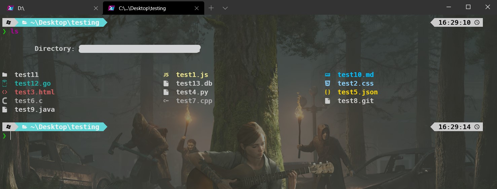
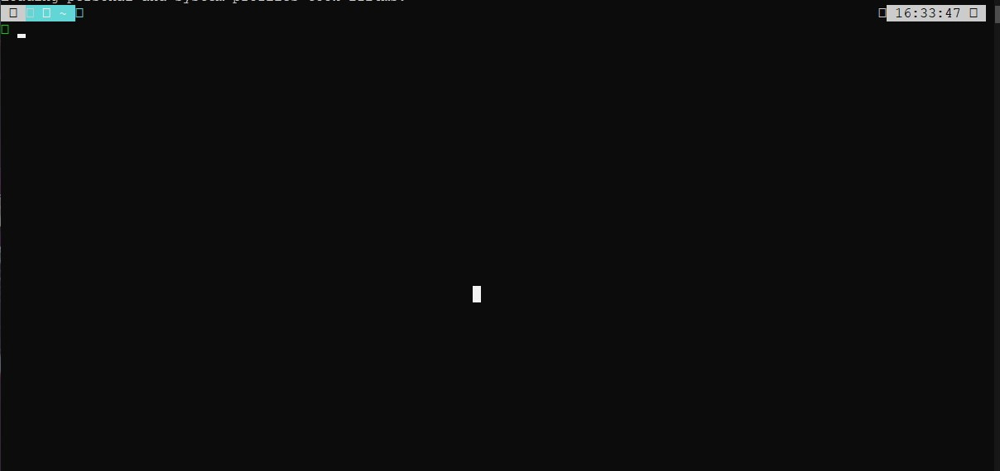

# PowerSheel Configuration

My powershell configuration

- **Preview**

  At the end of this guide your terminal will be like this.
  

- **Install/Update Powershell**

  First of all, I recommend you install the last version of powershell. You can download it from here. Remember that this version is going to replace the powershell 6 if you have installed it. (Does not affect powershell version 5)
  [https://github.com/PowerShell/PowerShell/releases](Download Powershell)

- **Install Windows Terminal (Optional)**

  If you want to personalize your terminal even more you can install Windows Terminal. You can download it from the microsoft store.
  [https://www.microsoft.com/en-us/p/windows-terminal/9n0dx20hk701?activetab=pivot:overviewtab](Windows Terminal)

- **Install OhMyZsh for windows (OhMyPosh)**

- **Install Fonts**

  If you dont install the fonts you probably will see something like this:

  

- **Sudo Command**

- **Install colors**

- **If you want you can use my theme**
